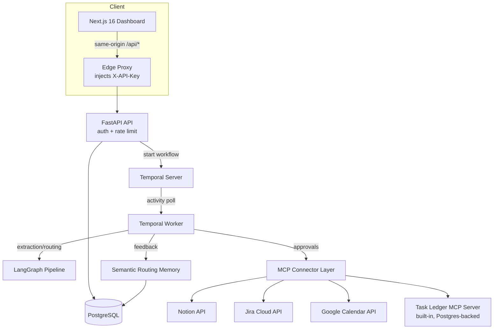

# Kairos — Ambient Action Extraction & Execution Engine

Kairos turns unstructured input — meeting transcripts, email threads, Slack
conversations — into **real, executed actions** across Notion, Jira, Google
Calendar, and a built-in Task Ledger MCP server, behind a human approval
checkpoint.

Paste a transcript → the pipeline extracts candidate action items with
verbatim source provenance → an operator reviews, edits, and approves →
approved items execute against real APIs with SHA-256 idempotency and
Temporal durable orchestration — and the system learns routing
preferences from every decision.

---

## Architecture



| Layer | Choice | Why |
|---|---|---|
| Durable orchestration | Temporal | Crash-safe workflows; 7-day approval wait; per-item execution with retry; no duplicate side effects |
| Extraction | LangGraph + structured LLM output (Gemini / OpenAI), deterministic offline fallback | Works with or without an LLM key; schema-validated output before anything executes |
| Execution | MCP dispatch layer (mcp 2.x) + official REST APIs | The Task Ledger is a genuine MCP server (`call_tool` dispatch, stdio entrypoint); external connectors call official APIs through a shared retry transport |
| Idempotency | SHA-256(batch, item, tool, canonical payload) checked against `execution_logs` | Replays and retries can never double-create |
| Auth | Single operator API key, injected server-side by the Next edge proxy | Key never ships to the browser; constant-time comparison; per-IP rate limits |
| Schema | Alembic migrations | Versioned, reproducible; app refuses to start on an unmigrated database |
| Memory | Embedding-backed routing feedback (Gemini/OpenAI embeddings, cosine similarity) | Learns from confirmations *and* overrides; degrades to keyword matching offline |

---

## Quick start (local development)

Prerequisites: Docker, Python 3.11+, Node 18+.

```bash
./scripts/start.sh
```

Launches PostgreSQL 16 (port 5435), Redis (6381), Temporal (7234, UI at
8234), applies Alembic migrations, then starts the Temporal worker, the
FastAPI API on `http://localhost:8000`, and the dashboard at
`http://localhost:3000`.

In development (no `API_KEY` set), auth is disabled and the system runs
end to end with zero configuration. Add provider keys in **Settings** to
enable live LLM extraction and real connector execution.

## Test suite

```bash
./scripts/test.sh
```

Runs the full battle suite (48 tests) against live Postgres and Temporal:
schema & payload validation, MCP tool dispatch and idempotency
deduplication, extraction and prompt-injection defense, routing-memory
learning loop, durable workflow lifecycle (approval signal, rejections,
unknown-item protection), API lifecycle, end-to-end integration,
auth/rate-limit/CORS security, and connector retry resilience.

## Production deployment

```bash
cp .env.example .env   # fill in the required secrets
docker compose -f docker-compose.prod.yml --env-file .env up -d --build
```

The production stack runs the API, worker, Postgres, and Temporal on an
internal bridge network — only the frontend is published (default
`http://localhost:3000`). A one-shot migrate container applies migrations
and gates startup on success. Required environment variables (missing
values fail loudly at compose interpolation):

| Variable | Purpose |
|---|---|
| `POSTGRES_PASSWORD` | Database password (never the dev default) |
| `API_KEY` | Operator API key injected by the proxy (≥16 chars) |
| `ENCRYPTION_KEY` | Fresh 44-char Fernet key for the OAuth vault |

Optional: connector tokens (`NOTION_API_KEY`, `JIRA_API_TOKEN`,
`JIRA_EMAIL`, `JIRA_DOMAIN`, `GOOGLE_CALENDAR_ACCESS_TOKEN`), LLM keys
(`GOOGLE_API_KEY` / `OPENAI_API_KEY`), observability (`LANGFUSE_*`),
`CORS_ORIGINS` for the published frontend origin.

Generate secrets:

```bash
python3 -c "from cryptography.fernet import Fernet; print(Fernet.generate_key().decode())"
openssl rand -base64 24
```

With `APP_ENV=production` the API enforces: API key present, `DEBUG=false`,
fresh encryption key, JSON logs, no OpenAPI/docs endpoints, HSTS headers.

## Key subsystems

**Human verification workbench.** Review cards show the verbatim source
snippet, speaker, assignee, confidence, and pre-filled tool payload.
Hovering a card highlights the exact source line. Decisions: approve,
modify payload or destination tool, or reject — individually or in bulk.

**Task Ledger MCP server.** A real MCP server (`mcp` 2.x SDK) exposing
`create_task`, `list_tasks`, `complete_task`, `delete_task`, backed by
Postgres. In-process execution goes through the same `call_tool` dispatch
path an external MCP client would use, and it can be run standalone:

```bash
python -m app.mcp.servers.task_ledger   # stdio MCP server
```

**Idempotency engine.** Before any execution, `SHA-256(batch_id +
item_id + tool + canonical_payload_json)` is checked against successful
`execution_logs`; a hit returns the recorded result without re-firing.

**Routing memory.** Every decision is stored (with an embedding when an
LLM key is configured). Similar past items reinforce confirmed routes,
flip suggestions toward overridden destinations, and penalize rejected
ones — with reasons surfaced in the review UI.

**Connector resilience.** A shared httpx transport retries 408/429/5xx
and transient network errors with jittered exponential backoff,
honoring `Retry-After` — below the activity level, so the idempotency
hash stays stable.

## Repository layout

```
backend/
  app/api/        REST endpoints (batches, history, connectors)
  app/core/       auth, security vault, rate limiting, logging, telemetry
  app/db/         SQLAlchemy models, async sessions, pool policy
  app/mcp/        connector layer, retry transport, Task Ledger MCP server
  app/pipelines/  LangGraph ingest/extract/route, semantic memory
  app/temporal/   workflow, activities, worker
  alembic/        versioned migrations
  tests/          battle test suites
frontend/         Next.js 16 dashboard + edge API proxy
scripts/          start.sh, test.sh
docker-compose.dev.yml   local infrastructure
docker-compose.prod.yml  production stack
.github/workflows/       CI (backend suite + frontend lint/typecheck/build)
```

## Security notes

- OAuth/API credentials are AES-256 (Fernet) encrypted at rest; decryption
  happens in memory at execution time only, and credential-shaped strings
  are redacted from error text before it can reach logs.
- All pasted text is treated as untrusted data: length-guarded, wrapped
  in explicit XML delimiters, and nothing executes without human approval.
- Per-IP rate limits: 60 reads/min, 10 writes/min; health probes exempt.
- Strict CORS (exact origins), security headers (nosniff, DENY, HSTS in
  production), JSON logs, no stack traces in responses.
- `DELETE /api/history/batches/{id}` erases a batch and its dependent
  records (operator erasure rights).

## Deployment scope — read before going live

Kairos is a **single-operator** system. This is a design boundary, not a
 limitation to fix later; verify it matches your intended usage:

- **One operator account.** Authentication is one shared API key
  (`API_KEY`), injected server-side by the frontend proxy. There are no
  user accounts, sessions, or per-user permissions.
- **One credential set per tool.** The OAuth vault stores *one* Notion,
  Jira, and Calendar connection (unique per provider), *one* Gemini/
  OpenAI key. If you deploy this for multiple people, they all share the
  same connected accounts, the same batches, and the same execution
  history — everyone who can reach the dashboard sees everything.
- **No per-user routing memory.** The semantic routing memory learns one
  operator's preferences; with several users it would blend them.

If you need true multi-user operation (each person connecting their own
Notion/Jira/Calendar accounts), that is a product-scale change:
per-user OAuth flows, a `user_id` dimension through every table, per-user
API keys or login, and per-user memory. Treat that as a follow-on
project, not a configuration change.

**Ready for:** a personal production deployment, a small team that
explicitly shares one set of tool connections, or a portfolio/interview
demo with real side effects.
**Not ready for:** public signups, tenant isolation, or compliance
regimes requiring per-user data separation.

## License

MIT — see [LICENSE](LICENSE).
