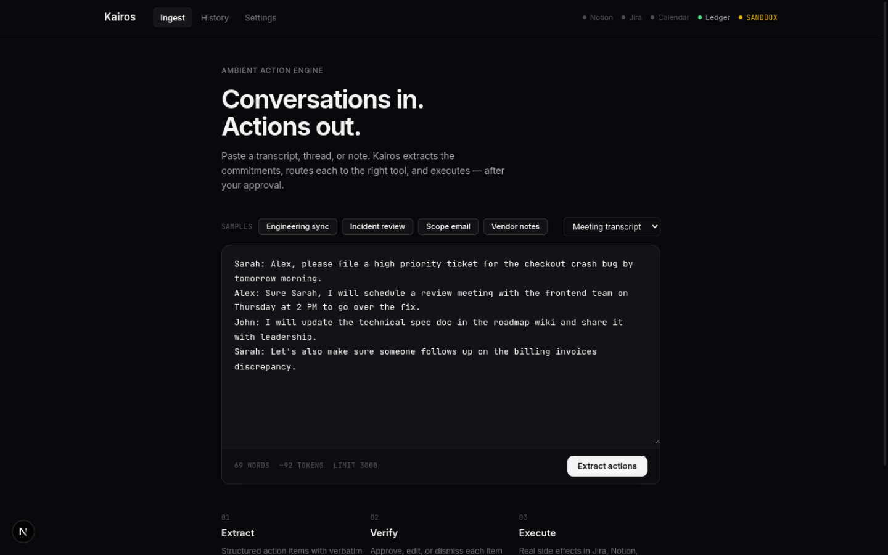
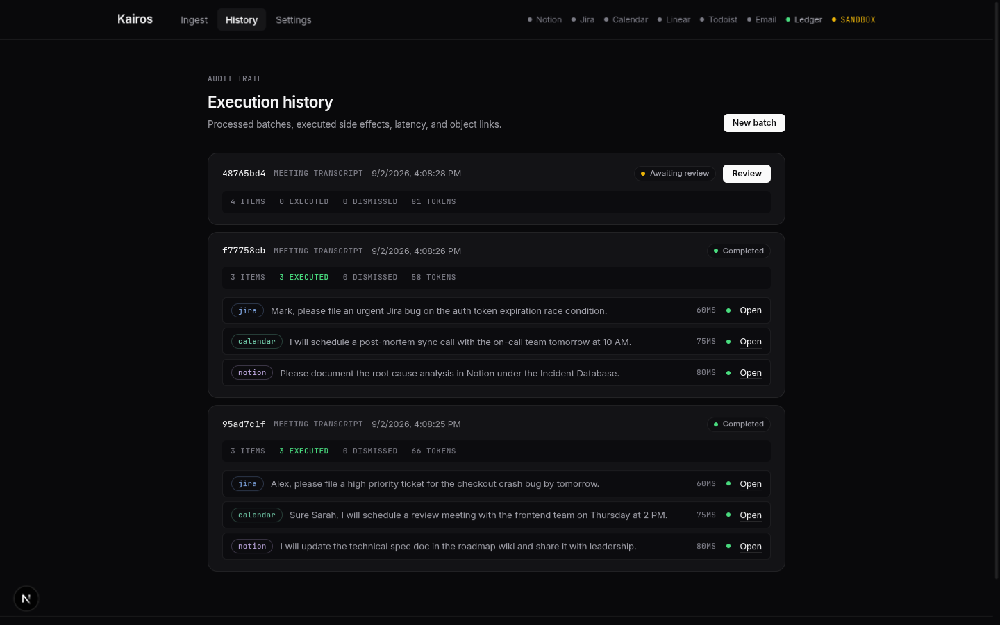
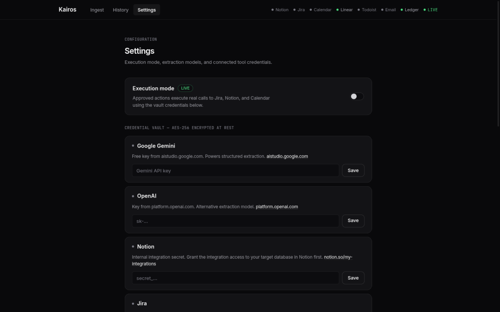

<div align="center">

# Kairos

**Ambient Action Engine — conversations in, executed actions out.**

Kairos extracts action items from meeting transcripts, email threads, and
chat logs — then executes each one in the tools you actually use, after a
human approves every single item.

[**Report a Bug**](https://github.com/sandeepbist/Kairos/issues) &nbsp;&middot;&nbsp;
[**Request a Feature**](https://github.com/sandeepbist/Kairos/issues) &nbsp;&middot;&nbsp;
[**Security Policy**](SECURITY.md) &nbsp;&middot;&nbsp;
[**Privacy Policy**](PRIVACY.md) &nbsp;&middot;&nbsp;
[**Terms**](TERMS.md)

[](LICENSE)
[](#testing)
[](https://www.python.org)
[](https://nodejs.org)
[](https://fastapi.tiangolo.com)
[](https://temporal.io)
[](https://modelcontextprotocol.io)

<sub>Self-hosted &middot; single-operator &middot; your transcripts never leave your infrastructure</sub>

</div>

---

## Table of Contents

1. [Screenshots](#screenshots)
2. [What Kairos does](#what-kairos-does)
3. [How it works](#how-it-works)
4. [Features](#features)
5. [Quick start](#quick-start)
6. [Configuration](#configuration)
7. [Testing](#testing)
8. [Production deployment](#production-deployment)
9. [Deployment scope](#deployment-scope)
10. [Repository layout](#repository-layout)
11. [Security posture](#security-posture)
12. [Contributing](#contributing)
13. [License](#license)

## Screenshots

<table>
<tr><td align="center"><sub><b>Ingest</b> — paste text, load samples, live token meter</sub></td></tr>
<tr><td></td></tr>
<tr><td align="center"><sub><b>Review workbench</b> — source on the left, action cards on the right, synchronized highlighting</sub></td></tr>
<tr><td></td></tr>
<tr><td align="center"><sub><b>Execution history</b> — audit trail with tool, latency, and external links</sub></td></tr>
<tr><td></td></tr>
<tr><td align="center"><sub><b>Settings</b> — execution mode switch and the encrypted credential vault</sub></td></tr>
<tr><td></td></tr>
</table>

## What Kairos does

Paste a transcript. Kairos extracts the commitments hidden in it — file
this ticket, schedule that review, update that doc — as structured,
schema-validated action items. Each one arrives in a review workbench with
its verbatim source quote, a suggested destination tool, and a confidence
score. You edit, approve, or dismiss. Approved items execute for real: a
Jira or Linear issue filed, a Notion page created, a calendar event
scheduled, a task in Todoist, Google Tasks, Asana, ClickUp, or the
built-in ledger, a GitHub issue, a Confluence page, or an email draft
waiting for your send.
Every decision feeds a routing memory that sharpens the next batch's
suggestions.

What it is **not**: a multi-user SaaS. One operator key, one set of
connected tool accounts, one shared history — see
[Deployment scope](#deployment-scope).

## How it works

```
you paste text ─ or forward a notetaker export ─ or let Gmail poll in
                ▼
        FastAPI API ── auth, rate limit
                │ starts a workflow
                ▼
        Temporal worker ── owns the whole batch lifecycle
                │
                ├─ extract: LangGraph + LLM (or offline parser)
                │   └─ schema-validated items with verbatim source quotes
                │   └─ long documents: chunked map-reduce, no truncation
                ├─ route: semantic memory adjusts tool + confidence
                │   └─ learns from every approve / override / reject
                ├─ wait: human review, live SSE progress, 7-day expiry
                │   └─ operator edits payloads, approves, or dismisses
                └─ execute: one activity per approved item
                    ├─ SHA-256 idempotency check → no duplicates on retry
                    ├─ Jira / Notion / Calendar / Linear / Todoist
                    ├─ GitHub issues / Confluence pages / Google Tasks
                    ├─ Asana tasks / ClickUp tasks
                    ├─ email drafts (you review before send)
                    └─ execution log with URL, latency, status
```

Each stage survives crashes: Temporal replays the workflow instead of
losing it, the idempotency hash prevents a replayed execution from filing
the same ticket twice, and an approval wait that never gets a decision
expires after seven days instead of piling up.

| Layer | Choice | Why |
|:---|:---|:---|
| Orchestration | Temporal | Durable workflows; per-item retry; the 7-day approval wait lives here, not in a process |
| Extraction | LangGraph | Stateless pipeline invoked from one activity; schema-validated output before anything executes |
| Task Ledger | MCP 2.x | A real MCP server — tools dispatch through `call_tool`, and it runs standalone over stdio |
| Schema | Alembic | Versioned migrations; the app refuses to boot on an unmigrated database |
| Memory | Embeddings | Gemini or OpenAI vectors, cosine similarity over your decision history; keyword matching when no key is set |

The extractor uses Google Gemini or OpenAI when a key is configured and a
deterministic local parser otherwise, so the full flow works on a fresh
clone with zero credentials — in that mode no text ever leaves the machine.

For Notion and Jira, connected OAuth tokens dispatch over real MCP
transport to the vendors' GA remote servers; static API keys keep using
REST, and any transport failure falls through to REST automatically —
approved actions run on the best path the credential supports.

It also runs the other direction: Kairos itself is an MCP server
(`python -m app.mcp.servers.kairos` over stdio) exposing submit_transcript,
list_pending_items, and approve_items — point Claude Desktop or Cursor at
it and the approval workbench is a tool call away, with the same operator
key gate and workflow validation the dashboard uses.

## Features

<table>
<tr>
<td width="50%" valign="top">

**Human in the loop, always**

Nothing executes without an explicit approval. Every card shows the
verbatim source quote behind the proposal, so you verify rather than trust.

**Real side effects**

Issues in Jira, Linear, GitHub, or ClickUp, Notion and Confluence
pages, Calendar events, Todoist, Google Tasks, and Asana entries,
email drafts, ledger rows — with SHA-256 idempotency so retries and
replays never double-create anything.

**Durable by construction**

Temporal owns the whole lifecycle. Kill the process mid-batch and the
workflow resumes; forget a batch and it expires in seven days.

</td>
<td width="50%" valign="top">

**Learns your routing**

Confirmations, overrides, and rejections become embedding-backed memory —
suggested destinations and confidence scores sharpen with use.

**Zero-credential mode**

No API keys configured? A deterministic local extractor runs everything
offline — nothing leaves the machine.

**Encrypted vault**

Connector and LLM credentials are AES-256 encrypted at rest, decrypted
only in memory for approved executions, and never echoed back.

</td>
</tr>
<tr>
<td width="50%" valign="top">

**Ingest from your notetaker**

Paste a Meetily/Granola/Otter export or a Slack workspace export —
front matter, timestamps, and summary chrome normalized automatically.
Or connect Gmail and let a 15-minute Temporal Schedule pull new threads.
Or install the Slack bot and let Socket Mode listen live — threads and
DMs flow in as batches with no public URL to expose.

**Outbound webhooks (Standard Webhooks)**

Every decision outcome — action executed, action rejected, batch
completed, batch expired — is signed and POSTed to any endpoint you
register: HMAC-SHA256 over `{msg_id}.{timestamp}.{payload}` with the
timestamp inside the signature (replay defense), secrets encrypted in
the vault and shown once, a retry ladder with jitter over durable
Temporal delivery, 410 auto-disable. Receivers verify with the official
`standardwebhooks` library — one line on their side, zero glue on
yours. n8n, Home Assistant, Node-RED, or a five-line Lambda; payloads
carry metadata only, never transcript content.

**Eval-guarded extraction**

A 25-case golden set gates every change: prompt tweaks and extractor
fixes must hold a 90% floor in CI. The offline extractor passes 100%.

</td>
<td width="50%" valign="top">

**Long documents, whole**

Hour-long meetings extract end to end: single-pass below 50k tokens,
speaker-turn-aware map-reduce above it, cross-chunk dedup.

**Twelve destinations**

Jira, Notion, Calendar, Linear, Todoist, GitHub, Confluence, Google
Tasks, Asana, ClickUp, email drafts you review before sending, and
the built-in Task Ledger.

</td>
</tr>
</table>

## Quick start

Requirements: Docker, Python 3.11+, Node 18+.

```bash
git clone https://github.com/sandeepbist/Kairos.git
cd Kairos
./scripts/start.sh
```

The script starts PostgreSQL (port 5435), Temporal (7234, UI on 8234),
applies migrations, then launches the worker, the API on
[localhost:8000](http://localhost:8000) (interactive docs at `/docs`), and
the dashboard on [localhost:3000](http://localhost:3000).

Open the dashboard, click a sample, press **Extract actions**, and approve
the items to watch them execute. With no tool credentials saved, enable
**Sandbox** in Settings first — otherwise the connectors correctly refuse
to make live calls.

To stop everything: the script traps Ctrl-C and tears down its processes;
`docker compose -f docker-compose.dev.yml down` stops the infrastructure.

## Configuration

Local settings live in `.env` (copy from `.env.example`). Anything saved
in the Settings UI is encrypted into PostgreSQL instead.

| Variable | Required | Purpose |
|:---|:---:|:---|
| `POSTGRES_PASSWORD` | **prod** | Database password — never the dev default |
| `API_KEY` | **prod** | Operator key (≥16 chars) guarding every API route |
| `ENCRYPTION_KEY` | **prod** | 44-char Fernet key for the credential vault |
| `CORS_ORIGINS` | **prod** | Exact allowed origins for the published frontend |
| `TRUST_PROXY` | optional | `true` only behind a proxy that overwrites X-Forwarded-For |
| `GOOGLE_API_KEY` / `OPENAI_API_KEY` | optional | Enables LLM extraction and semantic memory |
| `NOTION_API_KEY`, `JIRA_*`, `GOOGLE_CALENDAR_ACCESS_TOKEN`, `LINEAR_API_KEY`, `TODOIST_API_KEY` | optional | Live tool execution |
| `GITHUB_API_TOKEN`, `GITHUB_TARGET_REPO` | optional | GitHub issues (fine-grained PAT with Issues: write) |
| `ATLASSIAN_API_TOKEN`, `CONFLUENCE_SPACE_KEY` | optional | Confluence pages; the Jira credential already suffices |
| `GOOGLE_TASKS_ACCESS_TOKEN` | optional | Google Tasks (tasks-scoped OAuth token) |
| `ASANA_API_TOKEN` | optional | Asana tasks (personal access token) |
| `CLICKUP_API_TOKEN`, `CLICKUP_TARGET_LIST` | optional | ClickUp tasks (personal token + default list id) |
| `SLACK_APP_TOKEN`, `SLACK_BOT_TOKEN` | optional | Socket Mode bot; live Slack threads become batches |
| `ENCRYPTION_KEY_PREVIOUS` | optional | Old vault key during zero-downtime rotation |
| `WEBHOOK_ALLOW_PRIVATE_URLS` | optional | `true` lets webhooks target LAN receivers (link-local stays blocked) |
| `GMAIL_CLIENT_ID`, `GMAIL_CLIENT_SECRET` | optional | Gmail poller and email-draft token refresh |
| `SANDBOX_MODE` | optional | `true` simulates all executions, no side effects |
| `LANGFUSE_*` | optional | Tracing to a Langfuse host |

Generate the two required secrets:

```bash
# Fernet key for the credential vault
python3 -c "from cryptography.fernet import Fernet; print(Fernet.generate_key().decode())"

# Operator API key
openssl rand -base64 24
```

In production the config rejects a missing API key, a reused dev
encryption key, or `DEBUG=true` at startup — the process refuses to boot
rather than run wide open.

## Testing

```bash
./scripts/test.sh
```

**166 tests** run against live PostgreSQL and Temporal:

| Suite | Covers |
|:---|:---|
| Schemas & database | Payload validation, cascade constraints, JSONB integrity |
| MCP & idempotency | Tool dispatch via `call_tool`, SHA-256 deduplication |
| Extraction pipeline | Multi-speaker parsing, prompt-injection defense, length guard |
| Routing memory | The learning loop — overrides flip future suggestions |
| Temporal workflows | Approval signals, rejections, stale-signal protection, expiry |
| REST API | Full HTTP lifecycle, vault encryption round-trips |
| End-to-end | Ingest → extract → approve → execute → audit, on live services |
| Security & redaction | Auth, rate limits, CORS, payload caps, XFF spoofing, secret redaction |
| Resilience | Connector retry transport, batch-deletion guards |
| Long documents | Speaker-turn chunking, cross-chunk dedup, no-truncation recovery |
| Extraction evals | 25-case golden set, floor semantics, CI threshold gate |
| Ingestion expansion | Notetaker export normalization, Gmail poll no-op, schedule idempotency |
| Tier-2 sinks | GitHub / Confluence / Google Tasks / Asana / ClickUp connectors, endpoint maps, label normalization |
| Slack Socket Mode | Listen cycle, thread grouping, speaker attribution, seen-state dedup |
| Approval integrity | Update validators reject forged decisions before history |
| Outbound webhooks | Standard Webhooks signing (official verifier as oracle), SSRF guards, retry ladder, 410 auto-disable, live delivery E2E |
| Rotation & robustness | MultiFernet key rotation, pre-flight abort, worker/pool alignment, telemetry conventions |

CI runs the same suite plus frontend lint, typecheck, and build on every
push.

## Production deployment

```bash
cp .env.example .env    # fill in the required secrets
docker compose -f docker-compose.prod.yml --env-file .env up -d --build
```

<details>
<summary><b>What the production stack gives you</b></summary>

&nbsp;&nbsp;&nbsp;The API, worker, PostgreSQL, and Temporal run on an internal bridge
network — only the frontend is published. A one-shot migrate container
applies `alembic upgrade head` and gates startup on success. Missing
required variables fail at compose interpolation, before anything boots
half-configured.

&nbsp;&nbsp;&nbsp;Both images are multi-stage, run as non-root users, and have
healthchecks. The frontend is a Next.js standalone build whose edge proxy
injects the API key server-side: browsers never hold it, and the backend is
unreachable from outside the Docker network.

</details>

## Backup, restore, and key rotation

`./scripts/backup.sh` writes a compressed `pg_dump` plus a paired
`0600` key file — the dump contains Fernet-encrypted vault rows, so
the dump and its key are worthless apart. Restore: stop the API and
worker, `pg_restore --clean` into a fresh database, restore the paired
key as `ENCRYPTION_KEY`, restart, then check `/connectors` shows your
providers connected — that proves the vault decrypts.

Key rotation is zero-downtime: generate a fresh Fernet key, run
`ENCRYPTION_KEY=<old> ENCRYPTION_KEY_NEW=<new> python scripts/rotate_fernet_key.py`
(the script pre-flights every row, aborts before any write on the
first row it cannot decrypt, and re-encrypts in one transaction), then
set `ENCRYPTION_KEY=<new>` with `ENCRYPTION_KEY_PREVIOUS=<old>` and
restart. Remove `_PREVIOUS` after one verified poller cycle.

## Deployment scope

Kairos is built for one operator. Confirm this matches your use before
going live:

- **One shared key.** Anyone who can reach the dashboard holds full rights:
  every batch, verdict, and side effect is visible to everyone, and the
  linked provider accounts are pooled.
- **One credential per provider.** The vault stores a single Notion, Jira,
  Calendar, and LLM connection. Individual visitors cannot attach their own.
- **One memory.** Suggestion quality is learned for the deployment as a
  whole, not per person.

Giving real users isolated sign-ins and per-user OAuth is a product change —
per-person flows, a `user_id` column through every table, per-person memory —
not a settings toggle. If that is the goal, plan it as a follow-on effort
built on this codebase rather than expecting configuration to get there.

## Repository layout

```
backend/
  app/api/        REST endpoints (batches, history, connectors)
  app/core/       auth, vault, rate limiting, logging, telemetry, redaction
  app/db/         models, sessions, pool policy
  app/mcp/        connectors, retry transport, Task Ledger MCP server
  app/pipelines/  LangGraph ingest/extract/route, routing memory
  app/temporal/   workflow, activities, worker
  alembic/        migrations
  tests/          the battle suite
frontend/         Next.js dashboard + server-side API proxy
docs/             screenshots
scripts/          start.sh, test.sh
docker-compose.dev.yml    local infrastructure
docker-compose.prod.yml   production stack
.github/workflows/ci.yml  CI
```

## Security posture

- Connector and LLM credentials are AES-256-encrypted at rest; decryption
  happens in memory during approved executions only, and credential-shaped
  strings are stripped from error text before anything is logged.
- Submitted text is untrusted input: length-limited, wrapped in explicit
  delimiters, and parsed as data. An injected line in a transcript can at
  worst produce a suspicious-looking card for the operator to dismiss.
- Bodies over 1 MB return `413` at the edge; `raw_text` is capped at 50,000
  characters and approval payloads at 200 decisions.
- Per-IP rate limits: 60 reads/min, 10 writes/min — hardened against
  `X-Forwarded-For` spoofing at both the uvicorn and limiter layers.
- Exact-origin CORS, `nosniff`/`DENY`/HSTS headers, JSON logs, no stack
  traces in responses; `/docs` disabled in production.
- `DELETE /api/history/batches/{id}` erases a batch and its records;
  deleting a batch still mid-workflow returns `409` instead of corrupting
  state.

Found something sensitive? See [SECURITY.md](SECURITY.md) for how to
report it responsibly — including what is already hardened and what the
threat model excludes.

## Contributing

Bug reports and pull requests are welcome. The bar to clear: accompany
behavior changes with tests, write conventional commit messages, and argue
the case for any new dependency. Run `./scripts/test.sh` plus the frontend
checks locally; CI will run them again either way.

## License

MIT — see [LICENSE](LICENSE). `PRIVACY.md` and `TERMS.md` adapt documents
from the [General Legal](https://github.com/General-Legal/legal-templates)
library (CC0); per that library's notice they are drafting starting points,
not counsel.

<div align="center">

<sub><b>Kairos</b> — ambient action engine &middot; MIT</sub>

</div>
