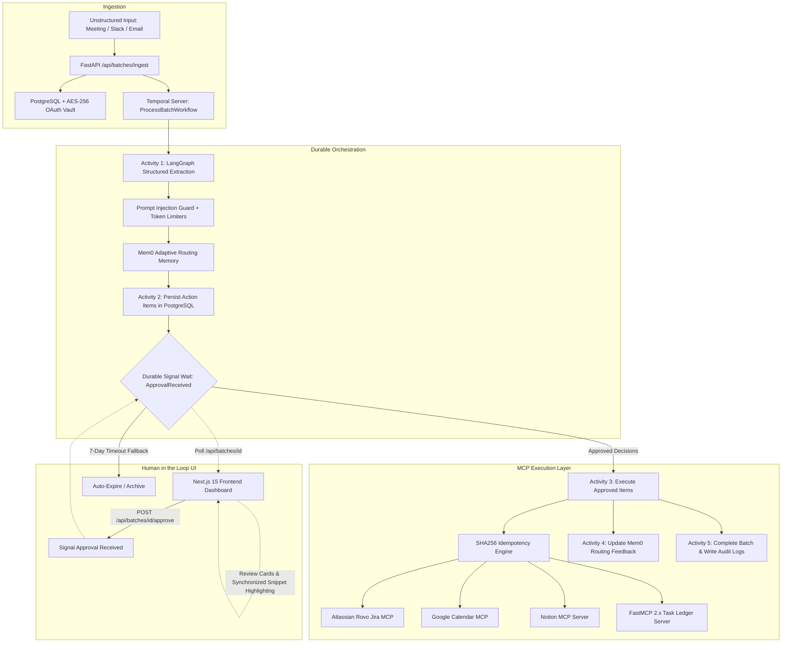

# Kairos — Ambient Action Extraction & Execution Engine

Kairos is a production-grade **Ambient Action Agent** that transforms messy, unstructured inputs (meeting transcripts, raw email threads, Slack conversations) into **real, verified side effects** across Notion, Jira, Google Calendar, and a custom internal Task Ledger via the **Model Context Protocol (MCP)**.

---

## 🏛️ Architecture Overview



---

## 🚀 Quick Start

### 1. Prerequisites
- Docker and Docker Compose
- Python 3.11+
- Node.js 18+ and npm

### 2. Start All Services with 1 Command
```bash
./scripts/start.sh
```
This automatically launches:
- **PostgreSQL 16 + pgvector** on `localhost:5435`
- **Redis 7** on `localhost:6381`
- **Temporal Server** on `localhost:7234` (Temporal UI on `http://localhost:8234`)
- **FastAPI REST Backend** on `http://localhost:8000` (Swagger UI at `/docs`)
- **Temporal Worker** listening on queue `kairos-batch-queue`
- **Next.js Frontend Dashboard** on `http://localhost:3000`

---

## 🧪 Battle Test Suite

Run the full, multi-phase automated test suite with live database and Temporal integration:

```bash
./scripts/test.sh
```

### Test Coverage Highlights (29/29 Passing):
- **Phase 1 (DB Schemas & Validation)**: Pydantic schemas, NullPool async session isolation, cascade constraints, JSONB payload validations.
- **Phase 2 (MCP Layer & Idempotency)**: Custom FastMCP 2.x server tools, Notion/Jira/Calendar/Ledger connectors, SHA256 deterministic idempotency deduplication.
- **Phase 3 (LangGraph & Memory)**: Multi-speaker dialogue extraction, direct address assignee attribution, XML tag injection sanitization, Mem0 positive/negative preference learning loop.
- **Phase 4 (Temporal Durable Orchestration)**: Multi-activity workflow execution, durable human approval signal wait, rejections handling, 7-day auto-archive.
- **Phase 5 (FastAPI REST API)**: Full HTTP lifecycle, AES-256 Fernet OAuth token vault encryption/decryption, Langfuse telemetry.
- **Phase 7 (End-to-End System Integration)**: Complete HTTP ingest $\rightarrow$ Temporal workflow $\rightarrow$ LangGraph extraction $\rightarrow$ UI Signal $\rightarrow$ MCP executions $\rightarrow$ DB audit logs.

---

## 🧩 Key Subsystems

### 1. Custom FastMCP 2.x Task Ledger
A custom Model Context Protocol server built with `mcp.server.mcpserver` that exposes 4 tools:
- `create_task(title, notes, priority, due_date)`
- `list_tasks(status)`
- `complete_task(task_id)`
- `delete_task(task_id)`

### 2. SHA256 Deterministic Idempotency
Prevents duplicate creations during network retries or signal replay:
$$\text{Hash} = \text{SHA256}(\text{batch\_id} + \text{item\_id} + \text{tool} + \text{SHA256}(\text{payload\_json}))$$

### 3. Synchronized Source Provenance
The Next.js frontend links extracted action items directly to the exact verbatim quotes in the original transcript with glowing synchronized hover highlighting.

---

## 📁 Repository Structure

```
Kairos/
├── backend/
│   ├── app/
│   │   ├── api/          # FastAPI routes (batches, history, connectors)
│   │   ├── core/         # AES-256 security vault, telemetry
│   │   ├── db/           # SQLAlchemy models and async session factory
│   │   ├── mcp/          # FastMCP server, connectors, client manager
│   │   ├── pipelines/    # LangGraph extraction, ingest guards, memory
│   │   ├── schemas/      # Strict Pydantic payload models
│   │   ├── temporal/     # Workflows, activities, background worker
│   │   ├── config.py     # BaseSettings configuration
│   │   └── main.py       # FastAPI application entrypoint
│   └── tests/            # Battle test suites (Phases 1-7)
├── frontend/             # Next.js 15 TypeScript Dashboard
├── scripts/              # start.sh, test.sh orchestration scripts
└── docker-compose.yml    # Isolated Postgres, Redis, Temporal services
```
